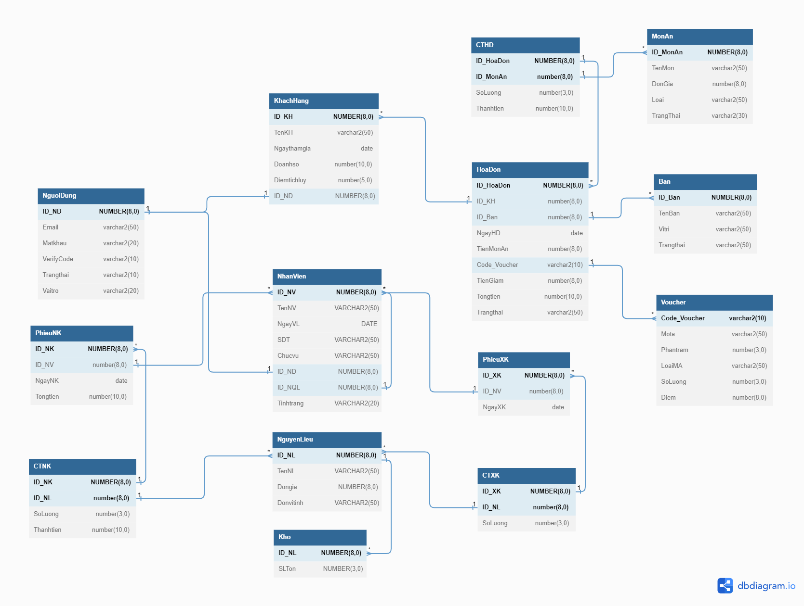

# Hệ thống quản lý nhà hàng - Royal The Dreamers Restaurant

## Giới thiệu đồ án

Nhà hàng là một phần không thể thiếu trong đời sống con người hiện đại, đó là nơi mà mọi người đến để thưởng thức những món ăn ngon, gặp gỡ bạn bè, hẹn hò cặp đôi, tổ chức các buổi tiệc tùng và sự kiện, và thư giãn sau khoảng thời gian kiếm tiền mệt nhọc. Hầu hết khách hàng đi đến nhà hàng để mong muốn tận hưởng được các món ăn ngon, không gian thoải mái cũng như sự phục vụ nhiệt tình và dịch vụ tốt nhất. Để đáp ứng được các vấn đề đó đòi hỏi những nhà hàng cần trang bị cho mình những hệ thống quản lí thích hợp và hiện đại nhất. Hệ thống quản lý nhà hàng trở thành một yếu tố quan trọng giúp các nhà hàng cạnh tranh và phát triển.  Nhận biết được sự cấp thiết đó, dự án này được xây dựng và phát triển phần mềm hệ thống “Quản lý nhà hàng”, chủ yếu tập trung vào việc lưu trữ; quản lý nhân sự, khách hàng; quản lý doanh thu; cho phép khách hàng tự gọi món tại bàn và phát triển giao diện dễ tương tác với người dùng, khách hàng.

## Mục tiêu của đề tài
Xây dựng hệ thống Quản lý Nhà Hàng một cách chuyên nghiệp, linh hoạt, có thể quản lý và lưu trữ được một lượng dữ liệu lớn. Hệ thống giúp người dùng dễ dàng hơn trong việc tổ chức, quản lý dữ liệu Khách hàng, quản lý Đặt bàn, quản lý Thực đơn,… và nhiều hơn thế nữa.

 

## Mô hình ERD

## Các chức năng chính trong ứng dụng
----------------
### Chức năng chính cho khách hàng
> * Đăng nhập
> * Đăng ký tài khoản
> * Đặt bàn và gọi món
> * Đổi điểm tích lũy
> * Quản lý thông tin cá nhân 
> * Xem lịch sử hóa đơn

### Chức năng nhân viên (bao gồm cả nhân viên tiếp tân, nhân viên kho và quản trị viên)
>*  Đăng nhập
>*	Quản lý Bàn
>*	Quản lý Nguyên Liệu
>*	Quản lý Kho
>*	Quản lý Nhập Kho
>*	Quản lý Xuất Kho
>*	Quản lý Thực Đơn
>*	Quản lý Nhân Sự
>*	Báo cáo Doanh Thu
>*	Thống kê Hóa Đơn
>*	Quản lý khách hàng

## Demo Sản Phẩm
-  Đăng Ký & Đăng Nhập:
----------------
>* Đăng Ký

>* Đăng Nhập

-  Khách Hàng:
----------------
>* Đặt Món

>* About Us

>* Thông Tin Cá Nhân

-  Admin:
----------------
>* Quản Lý Thực Đơn

  

>* Sửa Thực Đơn

>* Báo cáo & Thống Kê

## Các ngôn ngữ, công nghệ sử dụng
> * Ngôn ngữ sử dụng: `Java`
> * Công cụ lập trình giao diện: `JavaSwing`
> * Cơ sở dữ liệu: `Oracle`
> * Công cụ quản lý phiên bản: `Git`
>* Công cụ quản lý mã nguồn `Github`
>* ­Công cụ vẽ sơ đồ phân tích và thiết kế dữ liệu: `StarUML`, `draw.io`.

## Yêu cầu cài đặt
> * Sử dụng `JDK 17`
> * Sử dụng `ojdbc8.jar`

## Web API
> * API server mặc định chạy tại cổng `8081`.
> * File main để chạy API: [src/RTDRestaurant/Api/RestaurantApiApplication.java](src/RTDRestaurant/Api/RestaurantApiApplication.java)
> * Lệnh chạy khuyến nghị (để có Oracle JDBC): `java -cp "build/classes;src/External_Library/*" RTDRestaurant.Api.RestaurantApiApplication --server.port=8086`
> * Cấu hình Oracle mặc định của API: `jdbc:oracle:thin:@localhost:1521/XEPDB1`, user `huanvu`, password `123456`.
> * Có thể ghi đè bằng system properties hoặc biến môi trường: `restaurant.db.url`, `restaurant.db.username`, `restaurant.db.password` hoặc `RESTAURANT_DB_URL`, `RESTAURANT_DB_USERNAME`, `RESTAURANT_DB_PASSWORD`.
> * Có thể đổi cổng API bằng tham số chạy `--server.port=8086` hoặc `--port=8086`, hoặc biến môi trường `RESTAURANT_API_PORT` / `PORT`.
> * Giao diện web login/register mở tại `http://localhost:{port}/` (ví dụ `http://localhost:8086/`).

### Endpoint mẫu
> * `GET /api/health`
> * `POST /api/auth/login`
> * `GET /api/dishes?type=Aries&sortBy=priceAsc`
> * `GET /api/tables?floor=1&status=Con trong`
> * `GET /api/bills?from=2026-01-01&to=2026-12-31`
> * `GET /api/bill-items?billId=1`
> * `GET /api/staff`
> * `POST /api/staff`
> * `PUT /api/staff?id=1`
> * `DELETE /api/staff?id=1`
> * `GET /api/ingredients`
> * `POST /api/ingredients`
> * `PUT /api/ingredients?id=1`
> * `DELETE /api/ingredients?id=1`
> * `GET /api/vouchers`
> * `POST /api/vouchers`
> * `PUT /api/vouchers?code=ABC123`
> * `DELETE /api/vouchers?code=ABC123`
> * `GET /api/customers?userId=1`

## Tài liệu tham khảo

 - [Java Swing UI Design - Register and Verify Code With Email](https://github.com/DJ-Raven/java-swing-login-ui-001)
 - [Java Swing UI Design - School Management Dashboard](https://github.com/DJ-Raven/java-swing-school-management-dashboard)
 - [Java UI Design - Dashboard Desktop Application](https://github.com/DJ-Raven/java-ui-dashboard-008)

